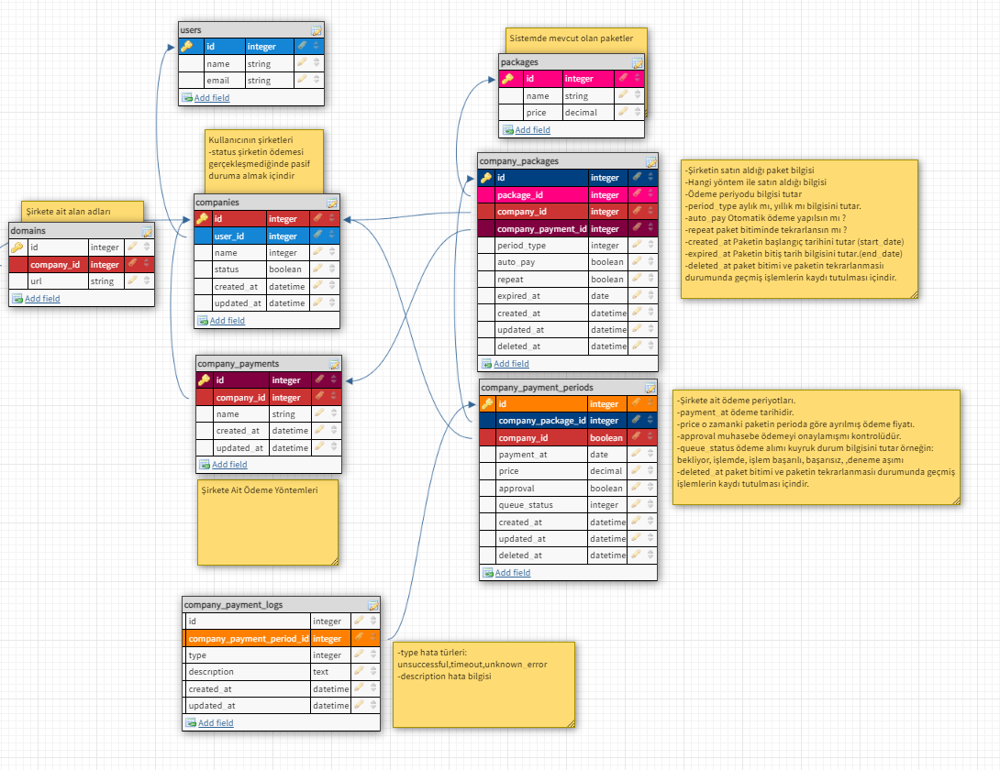

### Information
- **Laravel Framework Version:** 9.9.0
- **PHP Version:** 8.1.4
- **POSTMAN** https://documenter.getpostman.com/view/14752307/Uyr8kxhV
### Installation

Boş bir **ecommerce_case** adında database oluşturun ve aşağıdaki kodları çalıştırın.
```
php artisan migrate
php artisan db:seed
```

## About

- Case olduğundan dolayı hızlı anlaşılması açısından kodların çoğunda açıklamalar mevcuttur.
- İlk önce tüm senaryo üzerine veritabanı tasarımı çıkarılıp daha sonrasında yazılmıştır.
- İstenilen veri doldurmak için **seed/faker** kullanılmıştır ve ödeme sistemi içinde **Queue** kuyruk kullanılmıştır
- Schedule kullanılarak her gece saat 03:00 de ödeme var mı kontrolü için **command** yazılmıştır.
- Kuyruk çalıştırmak için : **php artisan queue:work --queue=company_payments** **<em>Local</em>** ortamında supervisord ile çalışmadığı için hata oluşumda tekrarlama olmayacaktır. Kuyruk ödeme kısmında hata oluşumu kısmını test ederken tekrar kuyruğu çalıştırmalısınız. 

### Design Patterns
- Repository Design Pattern
- Strategy Design Pattern

### Database Design

